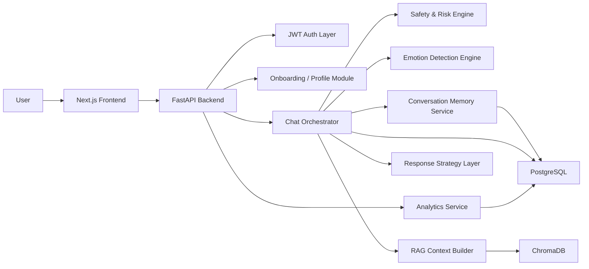

# Safebond

**Emotion-aware AI support for mental wellness**

**Formal academic title:**  
**Safebond: An Emotionally Intelligent AI Mental Wellness Assistant using NLP, RAG, and Multi-Agent Architecture**

Safebond is a full-stack AI/ML project that combines **emotion detection**, **safety-aware orchestration**, **conversational memory**, **retrieval-augmented personalization**, and **mood analytics** into one mental wellness support platform. It is intentionally designed to look and behave like a serious AI system, not a thin chatbot wrapper.

> Safebond is **not a replacement for licensed therapists, psychiatrists, or emergency services**. It is an AI-powered wellness support and reflection system built with strong ethical boundaries.

---

## What Makes Safebond Different

- Transformer-based emotion and sentiment analysis
- Safety and crisis-risk detection before response generation
- Memory-aware support using semantic retrieval from past reflections
- Structured onboarding with psychological intake and trusted-contact setup
- Short support-card responses instead of generic long chatbot paragraphs
- Dashboard analytics for mood trends, emotional distribution, and reflection activity
- Consent-based trusted-contact escalation design

---

## Core Features

### AI / ML
- Emotion detection with:
  - `j-hartmann/emotion-english-distilroberta-base`
  - `cardiffnlp/twitter-roberta-base-sentiment`
- Embedding-based memory with:
  - `sentence-transformers/all-MiniLM-L6-v2`
- Retrieval-augmented personalization using ChromaDB
- Risk-aware response moderation and crisis-resource routing
- Response strategy selection:
  - Calm mode
  - Gentle support mode
  - Reflective mode
  - Action mode
  - Pattern mode
  - Safety mode

### Product / UX
- Authentication with JWT
- 10-question onboarding intake
- Trusted contact capture
- Chat interface with compact emotional support cards
- Explainability tags:
  - Emotion
  - Mode
  - Risk
- “Why this response” strip
- Pinned support-plan panel
- Progress-over-time mini analytics inside chat
- Dashboard and insights views
- Dark theme

---

## Architecture



### Runtime Flow

1. User logs in and completes onboarding.
2. User sends a reflective message in chat.
3. Safety engine checks risk level.
4. Emotion engine detects primary emotion, confidence, and intensity.
5. Conversation memory stores the message and retrieves relevant past context.
6. RAG builds personalized context from prior reflections.
7. Response strategy layer selects the support mode.
8. Assistant returns compact support cards with explainability.
9. Analytics update mood and behavior trends over time.

---

## Tech Stack

### Frontend
- Next.js
- React
- Tailwind CSS
- Framer Motion
- Recharts
- Lucide React

### Backend
- FastAPI
- Python
- Pydantic
- SQLAlchemy
- Async PostgreSQL access
- JWT authentication

### AI / ML
- Hugging Face Transformers
- Sentence Transformers
- ChromaDB
- Local-first inference with optional free-tier extension paths

### Storage
- PostgreSQL for structured application data
- ChromaDB for semantic memory retrieval

---

## Implemented Modules

### 1. Authentication
- Register
- Login
- JWT issuance and validation
- Protected workspace routes

### 2. Onboarding and User Profile
- 10-question psychological intake
- Inferred emotional-risk baseline
- Trusted contact capture
- Consent-based safety preferences

### 3. Emotion Detection
- Transformer inference
- Confidence scoring
- Emotional intensity estimation
- Explainable response metadata

### 4. Conversational Memory and RAG
- Message storage in PostgreSQL
- Semantic chunking and embeddings
- ChromaDB memory search
- Context injection for personalized support

### 5. Safety Layer
- Self-harm and crisis-risk detection
- Response moderation
- Risk levels:
  - Low
  - Moderate
  - High
  - Critical
- Crisis-resource routing
- Trusted-contact support actions

### 6. Response Strategy Layer
- Selects support mode from emotion + risk + memory context
- Produces shorter, more structured support instead of long paragraphs

### 7. Analytics
- Mood trend charts
- Emotion distribution
- Risk timeline
- Session activity
- Heatmaps
- Weekly insight summaries

---

## Repository Structure

```text
safebond/
├── ai/                         # configs, notebooks, prompts
├── backend/
│   ├── app/
│   │   ├── api/               # FastAPI routes
│   │   ├── core/              # config, logging, middleware, security, runtime
│   │   ├── db/                # models, session, base
│   │   ├── integrations/      # HF models, embeddings, Chroma integration
│   │   ├── repositories/      # data access layer
│   │   ├── schemas/           # request/response models
│   │   ├── services/          # business logic and orchestration
│   │   └── main.py
│   ├── chroma/                # local Chroma persistence
│   └── tests/
├── data/
│   ├── evaluation/
│   └── knowledge_base/
├── docs/                      # architecture and implementation notes
├── frontend/
│   ├── app/                   # Next.js routes
│   ├── components/            # UI, chat, dashboard, providers
│   └── lib/                   # API client, types, helpers
├── infra/
│   └── docker/
├── scripts/
├── .env.example
└── docker-compose.yml
```

---

## Main Screens

- **Landing page**
- **Login / Signup**
- **Onboarding Intake Flow**
- **Chat Interface**
- **Emotion Response Cards**
- **Pinned Support Plan**
- **Seen Over Time progress strip**
- **Dashboard analytics**
- **Insights analytics**
- **Dark theme workspace**

---

## Local Setup

### 1. Clone and enter the project

```bash
git clone https://github.com/YOUR_USERNAME/safebond.git
cd safebond
```

### 2. Backend setup

```bash
cd backend
python3 -m venv .venv
source .venv/bin/activate
pip install -r requirements.txt
cd ..
cp .env.example .env
```

### 3. Start PostgreSQL

Make sure PostgreSQL is running locally and your `.env` database settings are correct.

### 4. Run backend

```bash
cd backend
source .venv/bin/activate
uvicorn app.main:app --reload --port 8000
```

### 5. Run frontend

In a new terminal:

```bash
cd frontend
cp .env.local.example .env.local
npm install
npm run dev
```

### 6. Open the app

- Frontend: [http://localhost:3000](http://localhost:3000)
- Backend docs: [http://localhost:8000/docs](http://localhost:8000/docs)

---

## Demo Prompts

### Stress / academic pressure
```text
I have been feeling really stressed about my final year project and I keep thinking I am falling behind everyone else.
```

### Anxiety / overthinking
```text
My mind has been racing all day and I cannot stop worrying about deadlines and what will go wrong.
```

### Burnout
```text
I feel mentally exhausted and even when I sit to work I cannot focus properly anymore.
```

### Loneliness
```text
I feel like I am dealing with everything alone and I do not know who to talk to.
```

### Moderate-risk safety demo
```text
I feel overwhelmed and sometimes I just want to disappear from everything for a while.
```

---

## Why This Is Not “Just a Chatbot”

Safebond is not a basic chatbot because it includes:

- transformer-based emotion understanding
- semantic conversational memory
- retrieval-augmented personalization
- safety-aware interception and moderation
- trusted-contact support design
- analytics and longitudinal trend tracking
- explainability in the visible product surface

This makes it a **modular AI wellness support platform**, not a single prompt-response wrapper.

---

## Ethics and Safety

- No therapist-replacement claims
- No clinical diagnosis claims
- Safety-aware response moderation
- Crisis-resource routing
- Consent-based trusted-contact escalation
- Supportive but bounded AI behavior

---

## Current Status

Implemented and working locally:

- backend foundation
- auth
- onboarding intake
- trusted contacts
- emotion detection
- safety routing
- memory + RAG
- chat orchestration
- analytics dashboard
- compact assistant response cards
- dark theme

---

## Future Improvements

- multilingual support
- voice interaction
- mobile deployment
- therapist / mentor dashboard
- fine-tuned wellness-specific models
- stronger evaluation pipeline

---

## Documentation

- Architecture pack: [docs/architecture.md](/Users/deepali/Documents/New project/safebond/docs/architecture.md)
- Repo structure notes: [docs/repo-structure.md](/Users/deepali/Documents/New project/safebond/docs/repo-structure.md)
- Backend foundation: [docs/backend-foundation.md](/Users/deepali/Documents/New project/safebond/docs/backend-foundation.md)
- Integration notes: [docs/integration-flow.md](/Users/deepali/Documents/New project/safebond/docs/integration-flow.md)

---

## Suggested Academic Positioning

Safebond can be presented as:

> A full-stack AI mental wellness support system that combines NLP, RAG, conversational memory, safety-aware orchestration, and emotional analytics into an ethically bounded user-facing platform.
