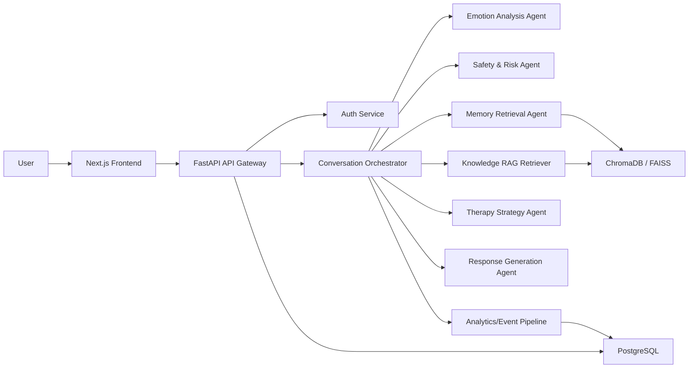

# Safebond Architecture Pack

## 1. High-Level System Architecture

Safebond follows a modular AI-platform architecture with clear separation between user experience, orchestration, model inference, storage, safety, and analytics.



### Reasoning

- Multi-agent separation makes the system easier to test, explain, and scale.
- Safety is isolated so it can overrule generation.
- RAG is split into personal memory retrieval and expert knowledge retrieval.
- Structured analytics makes the project look like a real ML product, not just an interface.

## 2. Complete Folder Structure

```text
safebond/
├── ai/
│   ├── configs/
│   ├── notebooks/
│   ├── prompts/
│   └── README.md
├── backend/
│   ├── app/
│   │   ├── api/
│   │   │   └── v1/
│   │   │       ├── endpoints/
│   │   │       └── router.py
│   │   ├── core/
│   │   ├── schemas/
│   │   └── main.py
│   ├── tests/
│   ├── pyproject.toml
│   └── README.md
├── data/
│   ├── evaluation/
│   └── knowledge_base/
├── docs/
│   ├── architecture.md
│   └── repo-structure.md
├── frontend/
│   └── README.md
├── infra/
│   └── docker/
├── scripts/
├── .env.example
├── .gitignore
└── docker-compose.yml
```

### Reasoning

- `backend/` is API-first and production deployable.
- `ai/` keeps experiments, prompts, evaluation configs, and model artifacts separated from API code.
- `data/` stores sanitized knowledge documents and evaluation data only.
- `docs/` makes the project interview- and GitHub-ready.

## 3. Multi-Agent Workflow

### Agent roles

1. **Emotion Analysis Agent**
   Infers primary emotion, secondary emotion, polarity, and intensity.
2. **Memory Retrieval Agent**
   Retrieves relevant past conversations and user-specific context.
3. **Safety & Risk Agent**
   Detects self-harm, suicidal ideation, panic escalation, or unsafe request patterns.
4. **Therapy Strategy Agent**
   Chooses support strategy such as reflective listening, grounding, reframing, or journaling prompt.
5. **Response Generation Agent**
   Produces the final response using agent outputs plus RAG context.

### Workflow

```text
Input -> Emotion -> Safety -> Memory + KB Retrieval -> Strategy -> Response -> Logging + Analytics
```

### Why this is strong academically

- Shows orchestration instead of monolithic prompting
- Supports ablation studies across agents
- Enables explainable AI outputs at each stage
- Makes evaluation modular and publishable

## 4. RAG Pipeline Architecture

Safebond uses **dual-source RAG**:

- **Personal RAG**: user conversation memories
- **Clinical-lite RAG**: curated wellness knowledge, coping techniques, psychoeducation, grounding exercises

### RAG stages

1. Clean and chunk source documents
2. Generate embeddings using `all-MiniLM-L6-v2`
3. Store vectors in ChromaDB or FAISS
4. Retrieve top-k memory snippets and top-k knowledge snippets
5. Re-rank with emotion and safety context
6. Build grounded prompt for the Response Generation Agent

### Retrieval ranking signals

- semantic similarity
- recency score
- emotional relevance
- safety priority
- source trust weight

### Why this matters

Basic chatbots only rely on current prompt context. Safebond’s RAG design provides personalization, longitudinal awareness, and safer grounded support.

## 5. Emotion Detection Pipeline

### Recommended models

- `j-hartmann/emotion-english-distilroberta-base`
- `cardiffnlp/twitter-roberta-base-sentiment`
- Optional intensity regressor fine-tuned on GoEmotions or custom labeled subsets

### Pipeline

1. Normalize text
2. Run emotion classifier
3. Run sentiment classifier
4. Estimate intensity score from logits, punctuation, negation, and emphasis features
5. Produce explanation payload

### Output example

```json
{
  "primary_emotion": "anxiety",
  "secondary_emotion": "stress",
  "intensity": 0.81,
  "confidence": 0.89,
  "explanation": {
    "emotion_cues": ["can't sleep", "overthinking", "scared"],
    "sentiment": "negative",
    "model_version": "emotion-distilroberta-v1"
  }
}
```

### Explainability ideas

- show top emotion cues
- expose confidence bands
- store model version and inference latency
- compare emotion classification with user feedback for calibration

## 6. Safety Layer Architecture

The safety layer is not a single if-statement. It is a **policy-driven interception system**.

### Safety stages

1. Rule-based lexical scan
2. Transformer risk classifier
3. Severity scoring
4. Policy decision
5. Safe response template selection
6. Optional escalation banner and emergency message

### Risk classes

- low: distress without danger
- medium: persistent hopelessness, panic, extreme isolation
- high: self-harm hints, suicidal expressions, violent intent
- critical: imminent danger or explicit plans

### Response rules

- Never give medical diagnosis
- Never encourage dependency on the AI
- Never provide self-harm instructions
- Always encourage human support in high-risk cases
- In critical cases, suppress normal chat flow and switch to crisis protocol

## 7. Database Schema

### Core relational tables

#### `users`

- `id`
- `email`
- `password_hash`
- `display_name`
- `timezone`
- `created_at`

#### `user_profiles`

- `user_id`
- `preferred_name`
- `support_preferences`
- `trigger_notes`
- `consent_flags`

#### `conversations`

- `id`
- `user_id`
- `title`
- `started_at`
- `last_message_at`

#### `messages`

- `id`
- `conversation_id`
- `role`
- `content`
- `created_at`
- `llm_provider`
- `trace_id`

#### `emotion_inferences`

- `id`
- `message_id`
- `primary_emotion`
- `secondary_emotion`
- `intensity`
- `confidence`
- `explanation_json`
- `model_name`

#### `safety_assessments`

- `id`
- `message_id`
- `risk_level`
- `risk_score`
- `policy_action`
- `classifier_version`

#### `memory_chunks`

- `id`
- `user_id`
- `source_message_id`
- `chunk_text`
- `embedding_id`
- `importance_score`
- `created_at`

#### `knowledge_documents`

- `id`
- `title`
- `category`
- `source_type`
- `trust_score`
- `version`

#### `analytics_daily_summary`

- `id`
- `user_id`
- `date`
- `dominant_emotion`
- `avg_intensity`
- `stress_count`
- `risk_events`

### Why this schema is strong

- supports auditability
- separates raw messages from model outputs
- enables analytics without recomputing everything
- supports future evaluation studies and offline retraining

## 8. API Architecture

### Public API groups

- `/api/v1/auth`
- `/api/v1/conversations`
- `/api/v1/messages`
- `/api/v1/emotions`
- `/api/v1/analytics`
- `/api/v1/safety`
- `/api/v1/health`

### Suggested endpoints

```text
POST   /api/v1/auth/register
POST   /api/v1/auth/login
GET    /api/v1/auth/me
POST   /api/v1/conversations
GET    /api/v1/conversations/{id}
POST   /api/v1/messages
GET    /api/v1/messages/{conversation_id}
POST   /api/v1/emotions/analyze
GET    /api/v1/analytics/mood-trends
GET    /api/v1/analytics/heatmap
POST   /api/v1/safety/evaluate
GET    /api/v1/health
```

### API engineering expectations

- async endpoints
- request tracing
- idempotency keys for message submission
- retry-aware external LLM wrappers
- caching for frequent analytics queries

## 9. Authentication Flow

### Recommended flow

1. User signs up with email and password
2. Backend hashes password with `bcrypt` or `argon2`
3. Access token issued via JWT
4. Frontend stores token in secure HTTP-only cookie if deployed as web app
5. Auth middleware injects `user_id` into request context

### Security additions

- rate limiting on login and message submission
- token expiry and refresh rotation
- CORS restrictions
- audit logs for high-risk events
- PII minimization and encryption at rest for sensitive fields

## 10. Deployment Architecture

### Student-friendly deployment

- Frontend on Vercel
- Backend on Render or Railway
- PostgreSQL managed free tier or local SQLite for demo mode
- ChromaDB persisted on disk for low cost

### Local full-stack setup

```text
Frontend (Next.js) + Backend (FastAPI) + PostgreSQL + ChromaDB
```

### Docker strategy

- one container for frontend
- one container for backend
- one database service
- optional vector service if not embedded

## 11. MVP vs Advanced Version

### MVP

- text chat
- emotion detection
- memory retrieval
- basic RAG
- safety checks
- mood trend dashboard

### Advanced

- voice input/output
- proactive journaling prompts
- weekly wellness summaries
- agent trace viewer for explainability
- fine-tuned risk classifier
- personalized coping recommendation engine

## 12. Research-Paper-Worthy Innovations

1. **Dual-memory RAG**
   Separates episodic personal memory from trusted wellness knowledge retrieval.
2. **Emotion-conditioned retrieval**
   Uses predicted emotion to bias semantic retrieval.
3. **Safety-first agent arbitration**
   Safety agent can override generation and strategy stages.
4. **Temporal emotional profiling**
   Tracks how emotional states shift across sessions.
5. **Explainable affect inference**
   Attaches cues, logits, and confidence calibration to emotion predictions.

### Possible evaluation questions

- Does emotion-conditioned retrieval improve perceived empathy?
- Does safety-first routing reduce unsafe outputs?
- Does memory-aware response generation improve user continuity scores?

## 13. UI/UX Design Direction

### Visual language

- calm, editorial, modern
- soft neutral backgrounds with selective accent colors
- premium typography, not generic dashboard styling
- high signal-to-noise ratio

### Screens

- onboarding and ethical consent
- chat workspace with emotion meter
- memory timeline
- mood analytics dashboard
- weekly reflections
- safety/help panel

### UX principle

The interface should feel supportive and intelligent, not clinical or overly playful.

## 14. Development Roadmap

### Phase 1

- repo scaffold
- architecture docs
- backend foundation
- auth + health APIs

### Phase 2

- emotion classifier integration
- safety service
- RAG ingestion pipeline
- memory storage

### Phase 3

- multi-agent orchestrator
- analytics pipeline
- frontend dashboard

### Phase 4

- evaluation suite
- deployment
- demos, screenshots, benchmarks, and viva preparation

## 15. Suggested GitHub Repository Structure

Make the repo communicate seriousness immediately:

- polished `README.md`
- architecture diagrams
- setup instructions
- sample screenshots
- API docs
- evaluation notes
- ethical disclaimer
- future work section

## 16. Resume-Ready Project Description

**Built Safebond, an emotion-aware AI mental wellness assistant using FastAPI, transformer-based NLP, dual-source RAG, ChromaDB, and multi-agent orchestration for safety-aware empathetic conversations, personalized memory retrieval, and mood analytics.**

## 17. Cost Optimization Strategy

- use local embedding models
- use compact classifier models for emotion and safety
- use Groq or Gemini only for final generation when needed
- cache embeddings and retrieval results
- summarize old conversations into memory chunks instead of storing huge context windows
- run PostgreSQL only in deployment, SQLite locally

## 18. Free API Integration Strategy

### Groq free tier

- fast response generation
- cheap or free experimentation
- suitable for orchestrated final response generation

### Gemini free tier

- fallback LLM provider
- useful for comparative evaluation and provider redundancy

### Strategy

- create provider adapter interface
- implement retry, timeout, and fallback chain
- log token usage per response

## 19. Local Model Execution Strategy

### Local-first components

- emotion classifier: Hugging Face transformer
- safety classifier: lightweight transformer or zero-shot pipeline
- embeddings: `all-MiniLM-L6-v2`
- reranker: optional sentence-transformer cross-encoder if hardware allows

### Hybrid generation strategy

- local models handle classification and retrieval
- cloud free-tier API handles final empathetic response if local generation is weak
- optional fully local generation via Ollama for offline demos

## 20. Laptop Hardware Optimization Tips

- prefer `distilroberta` over heavier encoders
- batch embedding jobs offline
- use `torch.set_num_threads()` to control CPU pressure
- quantize local generation models if using Ollama
- keep chunk sizes small and top-k retrieval modest
- avoid unnecessarily large context windows
- use SQLite + Chroma locally for lightweight demos

## Interview and Viva Talking Points

- Why a multi-agent architecture is safer than single-prompt chat
- How RAG supports personalization without fine-tuning on private mental-health data
- Why safety classification is isolated from response generation
- How explainability improves trust and debugging
- How the system balances ethics, affordability, and engineering realism
